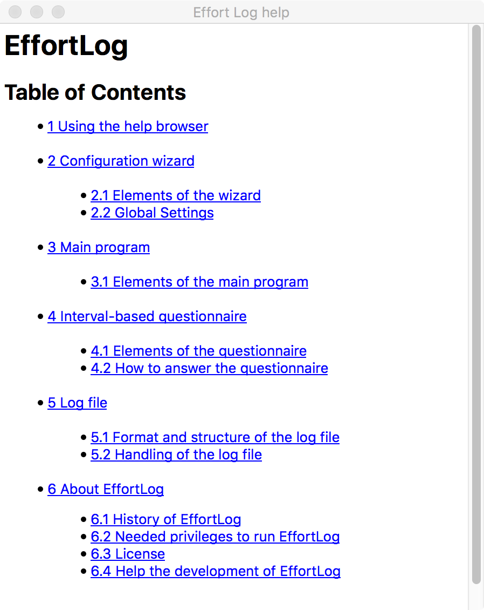

<!--
  Copyright (c) 2015-2017 by IT Center, RWTH Aachen University

  This file is part of EffortLog, a tool for collecting software
  development effort.

  EffortLog is free software: you can redistribute it and/or modify
  it under the terms of the GNU General Public License as published by
  the Free Software Foundation, either version 3 of the License, or
  (at your option) any later version.

  EffortLog is distributed in the hope that it will be useful,
  but WITHOUT ANY WARRANTY; without even the implied warranty of
  MERCHANTABILITY or FITNESS FOR A PARTICULAR PURPOSE.  See the
  GNU General Public License for more details.

  You should have received a copy of the GNU General Public License
  along with EffortLog.  If not, see <http://www.gnu.org/licenses/>.
-->

Using the Help Browser {#using-the-help-browser .chapter}
======================

You can get help by hitting **help** from the application menu bar under
Help. Additionally you can always bring up this help browser by hitting
**F1** from your keyboard if you are running Windows or Linux operating
systems or **Command+?** if you are on Mac OS X.

This help is split into multiple files which are connected through
links. These are highlighted with a blue color of the text. Additionally
each of the help files provides a simple navigation in the upper part of
the window. This navigation will guide you through the whole help
document if you hit the **next** button. You can go back to the last
help file with the **back** button. Additionally you can go at any time
back to the top of the documentation by hitting the **top** button.

The help browser might look like +@fig:help.

{#fig:help width="5in"}
