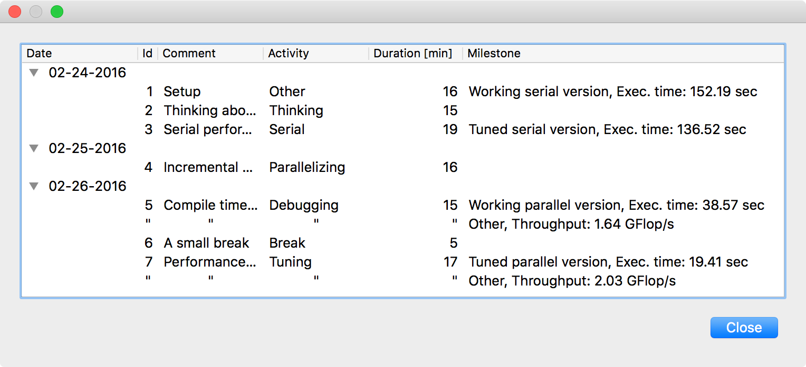

<!--
  Copyright (c) 2015-2021 by IT Center, RWTH Aachen University

  This file is part of EffortLog, a tool for collecting software
  development effort.

  EffortLog is free software: you can redistribute it and/or modify
  it under the terms of the GNU General Public License as published by
  the Free Software Foundation, either version 3 of the License, or
  (at your option) any later version.

  EffortLog is distributed in the hope that it will be useful,
  but WITHOUT ANY WARRANTY; without even the implied warranty of
  MERCHANTABILITY or FITNESS FOR A PARTICULAR PURPOSE.  See the
  GNU General Public License for more details.

  You should have received a copy of the GNU General Public License
  along with EffortLog.  If not, see <http://www.gnu.org/licenses/>.
-->

# Main program

The main program of Effort Log is a simple window providing the user
with information about the running logging.

## Elements of the Main Window

The main window in EffortLog consists of various elements which
described in detail below. Its main purpose is to maintain a simple
interface to provide the user about the current project he or she is
logging to and when the next scheduled logging event will be. Except of
the menubar and the toolbar, there are no elements which need user
interaction. The main window looks like [figure 3](#main).

{#fig:main width="5in"}

### Menubar

A simple menubar provides the user with information about the program.

#### File

**Log current effort**

Starts a questionnaire for logging the current effort. This can be
useful e.g. if the user wants to log earlier than the specified logging
interval.

**Read current log file**

Opens the current log file for quickly reading through it.

#### Help

**About**

Display information about EffortLog including the version and author of
the program.

**Help**

Open the help window displaying the contents of the EffortLog help.

A simple toolbar provides quick access to to functions of the menubar
and information about the currently active project.

### Statusbar

A statusbar in the lower part of the main window provides the user with
information about the running program. The statusbar displays a message
with the following information:

-   Indicator if the program is running.
-   A timer in form of a progress bar until the next event.
-   The time of the next scheduled logging event.

This message can be overwritten by tooltips when hovering with the mouse
pointer over a button.

## Elements of the Log File Viewer

The log file viewer consists of a convenient tree view to allow for a
quick overview over project's activities and milestones during the
active development. It can be used to review the main development
efforts and performance improvements. The activities are grouped by date
and hold their identifier, comment, activity, development duration in
minutes and if available the according milestone(s). If a milestone
exists for the activity, the type of milestone with the respective
performance measure is displayed. The respective activities of a date
can be viewed by clicking on the date in the first column of the viewer
and can be hidden by clicking it again. A close button is located in the
lower right of the window. Note that this window holds a viewer only. No
changes to the underlying log file can be made. The log file viewer is
depicted in [figure 4](#log_viewer).

{#fig:log_viewer
width="4.5in"}
