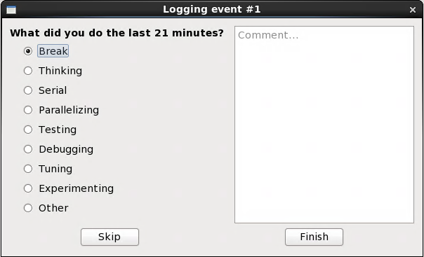
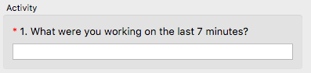
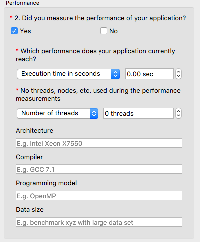
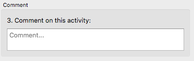
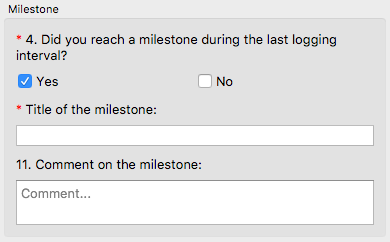

<!--
  Copyright (c) 2015-2018 by IT Center, RWTH Aachen University

  This file is part of EffortLog, a tool for collecting software
  development effort.

  EffortLog is free software: you can redistribute it and/or modify
  it under the terms of the GNU General Public License as published by
  the Free Software Foundation, either version 3 of the License, or
  (at your option) any later version.

  EffortLog is distributed in the hope that it will be useful,
  but WITHOUT ANY WARRANTY; without even the implied warranty of
  MERCHANTABILITY or FITNESS FOR A PARTICULAR PURPOSE.  See the
  GNU General Public License for more details.

  You should have received a copy of the GNU General Public License
  along with EffortLog.  If not, see <http://www.gnu.org/licenses/>.
-->

# Interval-based Questionnaire

This questionnaire is executed in a chosen interval and asks the user
about his or her current development's effort.

## Elements of the Questionnaire

The window of the questionnaire consists of the following elements.

{#fig:dialog_main}

### Statusbar

A simple statusbar in the upmost part of the window shows the number of
successfully logged events during the current session.

### Section 1: Activity

The upper part of the window shows a free-form filed to specify the
activity one was working on. It features auto-completion on previous
types of activities.

{#fig:activity}

### Section 2: Performance

The second section allows the use to specify performance-related data.
If features radio buttons with "Yes" and "No" where a single selection
is allowed. On specifying yes, a set of questions appear. The first one
handles the performance measurements in form of a metric and the raw
performance number. The choice for the metric include: execution time in
secondes, minutes and hours, throughput in GFlop/s, the speedup compared
to an optimized serial version of the code and other which allows for
free-form input.

The second question concerns the leveraged parallelism during the
measurements. The choice for the metric are number of threads or nodes
and other which allows for free-form input. Next are four questions in
the same style of a simple input form. The questions are regarding the
used architecture, compiler, programming model and data size for the
measurements. All four fields feature auto-completion on previous
inputs.

{#fig:performance}

### Section 3: Comment

The third section holds a text field to input comments on the current
activity.

{#fig:comment}

### Section 4: Milestone

The lower part of the window allows the use to specify milestone-related
data. If features radio buttons with "Yes" and "No" where a single
selection is allowed. On specifying yes, two more input forms appear.
The first one is a free-form input field to specify the title of the
milestone. Typical choices include: working serial version, tuned serial
version, working parallel version and tuned parallel version. The second
field lets one specify additional information as a comment linked to the
milestone.

{#fig:milestone}

### Buttons

The are three buttons in the lower part of the window:

-   Skip: If the user hits this button the current logging event will be
    skipped and the user is presented with the main program. The timer
    until the next event will be reset to the specified logging
    interval. Hotkey: **q**
-   Read Log: Opens a view on the logging events of the current project.
    See [Elements of the Log File Viewer](#elemts-of-the-log-file-viewer) 
    for additional information on the viewer.
-   Finish: If the user finished all input he or she can hit this button
    to save the current logging event and return to the main program.
    The timer until the next event will be reset to the specified
    logging interval. Hotkey: **f**

## How to Answer the Questionnaire

There are some default activities to choose:

-   Break
-   Thinking
-   Serial
-   Parallelizing
-   Testing
-   Debugging
-   Tuning
-   Experimenting

To get the results of the logs as accurate as possible please only
choose an activity from this list if it falls under this category. If
you are uncertain if it belongs to one of the categories above or you
worked on something different please choose other from the list. If you
did choose other activity please describe it in detail in the comment
field.

The comment field is used to keep track of additionally information you
want to add to your logs.

If you want to take a brake for some time longer than the default
logging interval you do not have to quit the program. You might just let
it run in the background and it will set a bigger time slot for your
break as soon as you return back to your work place.
