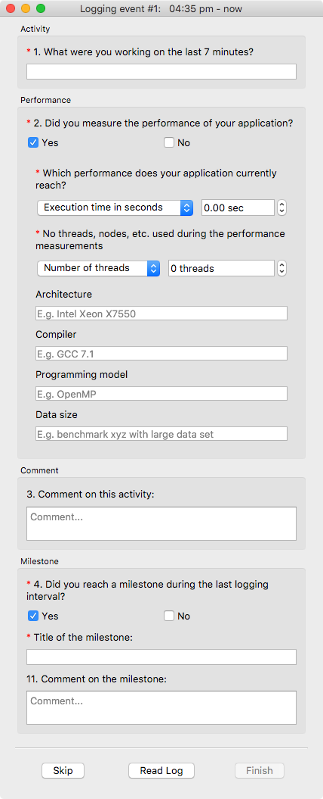

<!--
  Copyright (c) 2015-2017 by IT Center, RWTH Aachen University

  This file is part of EffortLog, a tool for collecting software
  development effort.

  EffortLog is free software: you can redistribute it and/or modify
  it under the terms of the GNU General Public License as published by
  the Free Software Foundation, either version 3 of the License, or
  (at your option) any later version.

  EffortLog is distributed in the hope that it will be useful,
  but WITHOUT ANY WARRANTY; without even the implied warranty of
  MERCHANTABILITY or FITNESS FOR A PARTICULAR PURPOSE.  See the
  GNU General Public License for more details.

  You should have received a copy of the GNU General Public License
  along with EffortLog.  If not, see <http://www.gnu.org/licenses/>.
-->

Interval-based Questionnaire {#interval-based-questionnaire .chapter}
============================

This questionnaire is executed in a chosen interval and asks the user
about his or her current development's effort.

Elements of the Questionnaire {#elements-of-the-questionnaire .section}
-----------------------------

The window of the questionnaire consists of the following elements.

{#fig:dialog_main
width="7in"}

### Statusbar {#statusbar .subheading}

A simple statusbar in the upmost part of the window shows the number of
successfully logged events during the current session.

### Activity chooser {#activity-chooser .subheading}

The left part of the window shows a chooser for different activities
allowing the user to quickly specify the activity he or she was working
on. It consists of big radio buttons. There can be only one selected
button at any time. The default activity is break. Additionally upon
startup of the questionnaire the left pane is selected by default.
Therefore the user can switch between different activities with the
**up-key** and **down-key**. To quickly select one specific activity
there are hotkeys for each of them. The following lists provides an
overview of the available activities and the matching hotkeys.

-   Break b

-   Thinking h

-   Serial s

-   Parallelizing p

-   Testing t

-   Debugging d

-   Tuning u

-   Experimenting e

-   Other o

### Comment field {#comment-field .subheading}

The center part of the window holds a text field to input comments on
the current activity.

### Milestone field {#milestone-field .subheading}

The right part of the window allows the user to select one or multiple
milestones reached in the current logging interval. When at least one
milestone is selected, an additional questionnaire pops up. It lets the
user specify the milestone with its performance measure and is described
in detail in [Log File Viewer](#log-file-viewer).

### Buttons {#buttons .subheading}

The are two buttons in the lower part of the window:

-   Skip: If the user hits this button the current logging event will be
    skipped and the user is presented with the main program. The timer
    until the next event will be reset to the specified
    logging interval. Hotkey: **q**
-   Finish: If the user finished all input he or she can hit this button
    to save the current logging event and return to the main program.
    The timer until the next event will be reset to the specified
    logging interval. Hotkey: **f**

How to Answer the Questionnaire {#how-to-answer-the-questionnaire .chapter}
-------------------------------

There are some default activities to choose:

-   Break
-   Thinking
-   Serial
-   Parallelizing
-   Testing
-   Debugging
-   Tuning
-   Experimenting

To get the results of the logs as accurate as possible please only
choose an activity from this list if it falls under this category. If
you are uncertain if it belongs to one of the categories above or you
worked on something different please choose other from the list. If you
did choose other activity please describe it in detail in the comment
field.

The comment field is used to keep track of additionally information you
want to add to your logs.

If you want to take a brake for some time longer than the default
logging interval you do not have to quit the program. You might just let
it run in the background and it will set a bigger time slot for your
break as soon as you return back to your work place.
