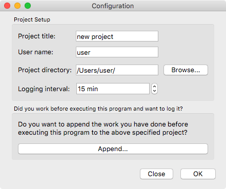

<!--
  Copyright (c) 2015-2019 by IT Center, RWTH Aachen University

  This file is part of EffortLog, a tool for collecting software
  development effort.

  EffortLog is free software: you can redistribute it and/or modify
  it under the terms of the GNU General Public License as published by
  the Free Software Foundation, either version 3 of the License, or
  (at your option) any later version.

  EffortLog is distributed in the hope that it will be useful,
  but WITHOUT ANY WARRANTY; without even the implied warranty of
  MERCHANTABILITY or FITNESS FOR A PARTICULAR PURPOSE.  See the
  GNU General Public License for more details.

  You should have received a copy of the GNU General Public License
  along with EffortLog.  If not, see <http://www.gnu.org/licenses/>.
-->

# Configuration Wizard

The settings dialog is the first window to open upon execution of the
program. Its main goal is it to present the user with a convenient tool
to set up the configuration needed for monitoring programming effort.

## Elements of the Wizard

The configuration dialog consists of one unified window which provides
access to all user-input needed. The dialog holds a vertical list of
entries. Each entry is divided into a label which explains the expected
input, a filed for the input and optional a button for easier access to
the expected input. The user can browse through the input fields by
hitting "tab" on the keyboard. The main window is divided into four
distinct areas which will be explained in detail in the following section.
The configuration wizard is depicted in [figure 2](#conf).

{#fig:conf width="5in"}

## Global Settings

The configuration wizard will set the following user-specified global
settings of the main program:

-   The specified user name to distinct between multiple users working
    on the same project.
-   The name of the project to distinct between multiple projects a user
    might work on.
-   The current development stage of the project.
-   The logging interval in minutes which sets the default interval at
    which the questionnaire is executed.
-   The output directory to which the log file is saved.
-   The name of the output file.
